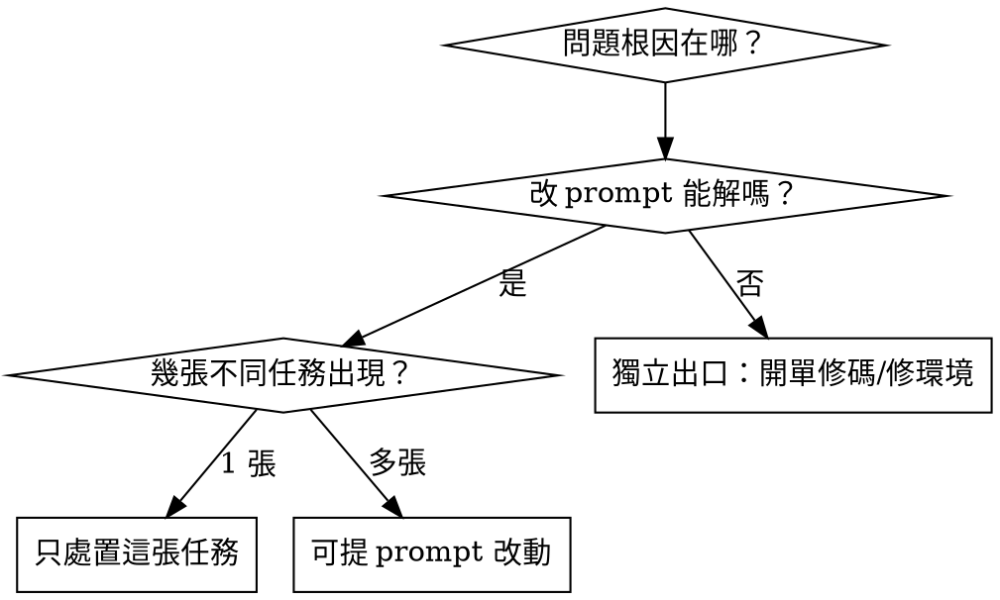

# healthCheck — 平台健檢判準

## 核心原則

**一次蒐集 → 一次診斷 → 一次裁決。**

per-agent 指標與 per-task 歷程是同一批資料的兩個投影，不是兩種分析。分開跑必然產生「每個切片都判對、合起來沒人負責」——run#1 有七個 agent 各自正確判定 asset bundle 屬環境層，然後沒有任何人去修。

## 兩種 scope，同一套判準

| scope | 範圍 | 觸發 |
|---|---|---|
| `platform:<N>d` | 全平台近 N 天 | 排程 |
| `task:<id>` | 單張任務 | 人工按下 |

差別只在餵進來的資料範圍，判準與輸出格式完全相同。

## 讀什麼

**先讀壓縮後的兩個投影，不要先拉 prompt body。** 確定哪幾關有問題之後，才對那幾關拉 prompt 深診。

| 訊號 | 代表什麼 | 陷阱 |
|---|---|---|
| `repeat_calls.avg` | 同一張任務在該關被呼叫幾次 | **本平台最真實的失敗訊號**，優先於 `failed_calls` |
| `failed_calls` | 執行崩潰次數 | 幾乎恆為 0，無鑑別力。本平台的失敗是「跑完但沒用」，全記 completed |
| 狀態轉移序列 | 任務走過的關卡順序 | 看**震盪**（`coding→qa→coding→qa`）——這是 per-agent 視角結構上看不到的 |
| 任務 wall-clock | 從建立到完成 | 用 p50/p90，**不要用 avg**（被極端值洗掉） |
| `token.avg_duration_ms` | 單次呼叫耗時 | 這**不是**任務耗時，別混用 |
| `cost_usd` | 實際花費 | 談省錢一律看這個，**不看 tokens**——降模型省錢不省 token，加驗證步驟花 token 但可能省錢 |
| `cache_create` vs `cache_read` | 快取重寫比率 | 前者單價是後者 12.5 倍。偏高＝prompt 前綴不穩定 |
| `rejections.by_category` | 人工退回類型 | 「規格誤解」多＝分析層；「實作錯誤」多＝實作層 |
| `tasks.stopped_rate` / `reentry` | 該關經手的任務有多少卡死／彈跳幾次 | 高＝常失敗或反覆重跑 |
| `qa_rejections.count` | QA 自動退回中屬本 agent 的那類根因 | `impl_miss`＝實作精確度；`spec_unclear`＝規格漏前提 |
| `qa_rejections.env_flaky_count` | 環境／暫時性雜訊 | **不是 prompt 問題，不得據此改 prompt**；高則屬 pipeline／環境層 |
| `wiki_drift`（chat／cs） | 文件與程式碼矛盾的回報 | 反映知識庫品質，非該 agent 的推理品質 |
| `repeat_calls` 的 multi-gate note | 該 stage 底下有多個不同閘門 | 有 note 時次數**不等於**本關重跑，別讀成空轉 |
| `prompt_version.calls_since` | 現行這版 prompt 上線後累積的樣本數 | 遠小於 `token.calls` ＝ 指標多數由**舊版** prompt 產生，**不得據此判斷本版好壞**；`seeded: true` 表示上線時間是用檔案 mtime 估的，更要打折 |
| `token.calls` = 0 | 沒被呼叫過 | **不是健康**。照實寫零樣本，不得憑空編問題或改 prompt |

## 裁決：證據強度決定能動哪一層

**證據單位是「幾張不同任務」，不是「被提到幾次」。** 一張任務走過七關會在七個地方各出現一次，用次數算會把一張誤算成七個獨立證據。

單張任務的處置只能是：重跑哪一關／缺什麼資訊／該走 respec。疑似系統性但只有一張證據時，寫成**候選訊號**存著，不得直接改 prompt。

## 什麼才配列入修改

目標**有序**，衝突時照順序裁決：

**穩定 > 準確 > 省 token**

一個改動若提升準確率但降低穩定度，不列入。實測為省 token 犧牲穩定，反而在失敗迴圈上多花更多。

每個提案**必須指名**：動哪一個指標、現值多少、預期往哪個方向。三者缺一律 drop，不進候選清單。

| 目標 | 對應指標 |
|---|---|
| 穩定 | `stopped_rate`、`reentry`、震盪序列出現率 |
| 準確 | QA 自動退回率、人工退回率、`repeat_calls.avg` |
| 省 token | `cost_usd` |

平台程式碼 bug（`app/server/**`）一律列入，走獨立出口。

## 紅旗——出現就是判錯了

- **判定「非 prompt 可解」卻同時輸出 `<prompt>`** → 用改 prompt 去補程式碼 bug，會讓真 bug 被掩蓋且永遠留著
- **拿單張任務的證據去改全平台 prompt** → 過擬合，改完影響所有任務
- **用 `UI體驗` 退回率產生 prompt 改動** → 見下方盲區，已實測無效
- **指標都正常還硬生一份改動** → 不為改而改。`severity` 給 `ok`、整段省略 `<prompt>`
- **提案講不出要動哪個指標** → 「有幫助」不是驗收條件

## 已知盲區——不得宣稱已覆蓋

- **視覺／體感抓不到。** `UI體驗` 退回率只是**觀測指標**：訊號僅在人工退回時產生，QA 對視覺全盲、人看到之前零攔截。它系統性低估，且改善途徑不在 prompt——實測補輸入端的視覺規格後，UI 退回反而 19%→30%。
- **輸出契約會篩掉診斷。** 長文字放進 JSON 必被切爛，而「有話要說」的那幾份剛好最長。順序固定 `<prompt>` → `<diagnosis>` → `<rationale>` → `<result>`。
- **本判準覆蓋的是 QA 與 pipeline 指標看得見的部分。** 看不見的那類，健檢本來就抓不到。

## 驗證

改判準之後，比對前後的 `prompt_logs` 確認新規則真的送進去了。**只看產物鑑別力很弱**——產物看起來變好可能只是抽樣運氣。
